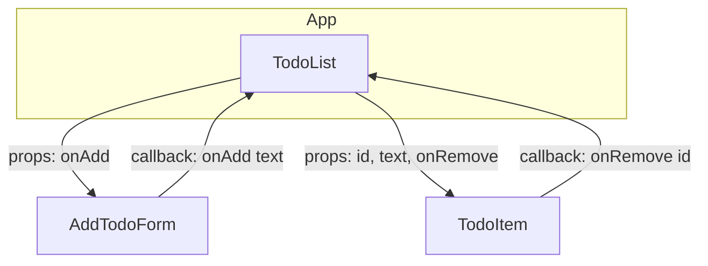

# React + Vite

This template provides a minimal setup to get React working in Vite with HMR and some ESLint rules.

Currently, two official plugins are available:

- [@vitejs/plugin-react](https://github.com/vitejs/vite-plugin-react/blob/main/packages/plugin-react) uses [Babel](https://babeljs.io/) for Fast Refresh
- [@vitejs/plugin-react-swc](https://github.com/vitejs/vite-plugin-react/blob/main/packages/plugin-react-swc) uses [SWC](https://swc.rs/) for Fast Refresh

## Expanding the ESLint configuration

If you are developing a production application, we recommend using TypeScript with type-aware lint rules enabled. Check out the [TS template](https://github.com/vitejs/vite/tree/main/packages/create-vite/template-react-ts) for information on how to integrate TypeScript and [`typescript-eslint`](https://typescript-eslint.io) in your project.

## 📌 Component Tree + Data Flow diagram

App 
├── TodoList (state: todos[]) 
│ ├── AddTodoForm (props: onAdd) 
│ └── TodoItem (state: completed, props: id, text, onRemove)

## Description
- **App** is the composition root. It renders `TodoList` but does not store any todos.  
- **TodoList** owns the list of todos (`state: todos[]`). It passes props down to child components and receives callbacks from them.  
- **AddTodoForm** receives a prop `onAdd`. When the user submits a new task, it calls back up to `TodoList` with the new text.  
- **TodoItem** manages its own `completed` state, but also receives `id`, `text`, and `onRemove` from `TodoList`. When the delete button is pressed, it calls back up with its `id`.  
- **Data flow is unidirectional:** props go down from parent → child, while events (callbacks) go up from child → parent.
